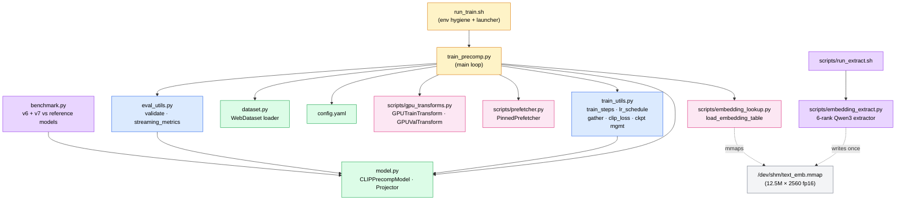
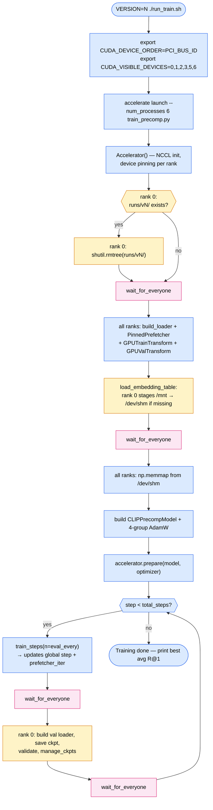
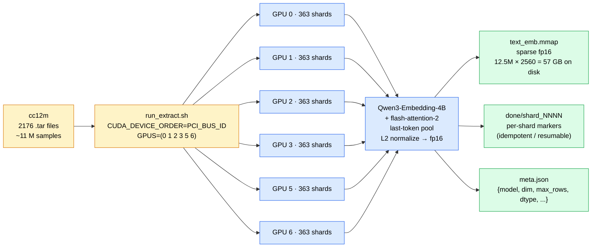

# CLIP from scratch on cc12m

A small implementation of [CLIP](https://arxiv.org/abs/2103.00020) trained from scratch on
[CC12M](https://github.com/google-research-datasets/conceptual-12m) (~11M image–caption pairs).
The image encoder is a pretrained EfficientNet B1 (current default; swappable via the
`image_backbone` arg in `model.py`). The text encoder is a frozen, pretrained sentence-
embedding model — `BAAI/bge-base-en-v1.5` by default, a modern retrieval-trained model
that drops in for BERT but with much stronger semantic embeddings. Two small MLP
projectors map both into a shared 512-dim space, and a learned temperature scales the
cosine-similarity logits.

Multi-GPU with 🤗 Accelerate, using the OpenCLIP "gather features" trick so that the
contrastive loss is computed over the full *global* batch rather than each rank's local
slice — i.e. on N GPUs at batch B per rank, every anchor sees N·B − 1 negatives, not B − 1.

## Architecture

```
image (224x224) -> EfficientNet B1 (pretrained, trainable) -> 1280 -> MLP -> 512 ─┐
                                                                                    ├─ cosine sim
text  (≤64 tok) -> BGE-base-en-v1.5 (pretrained, frozen)    ->  768 -> MLP -> 512 ─┘
                                                                             ↑
                                                                 learned log-scale
                                                                 temperature (init 0)
```

| Component | Params | Notes |
|---|---:|---|
| EfficientNet B1 backbone | 6.5 M | ImageNet-pretrained, trainable |
| BGE-base-en-v1.5 backbone | 109 M | frozen, `[CLS]` of last hidden state |
| Image projector | 1.6 M | 2-layer MLP (GELU) |
| Text projector | 1.3 M | 2-layer MLP (GELU) |
| `log_scale` | 1 | learned |
| **Trainable total** | **9.7 M** | |

## Files

```
train_precomp.py      # main training entrypoint (precomp pipeline). Builds loader +
                      # prefetcher + transforms + model + optimizer, runs the
                      # eval-interval loop calling train_steps + validate.
train_utils.py        # train_steps inner loop, lr_schedule_factor, gather_features,
                      # clip_loss_gathered, save_ckpt, manage_ckpts.
eval_utils.py         # validate (1M-pair pass) + streaming_metrics (R@k + mean rank).
model.py              # CLIPPrecompModel (image bb + projectors + log_scale) + Projector.
                      # CLIPModel (v6 dual-tower) kept for benchmark.py / evaluate.py.
dataset.py            # WebDataset streaming loader. JPEG decode + 256-crop → uint8 HWC
                      # + sample_idx (the cc12m stem parsed as int, used as memmap row).
benchmark.py          # v6 + v7 vs OpenAI CLIP / OpenCLIP cc12m on the 5000-pair set.
evaluate.py           # R@{1,5,10} on a single v6 checkpoint (legacy, used by v6 ckpts).
run_train.sh          # launcher: sets CUDA_DEVICE_ORDER=PCI_BUS_ID and the 5090 GPU
                      # mask, then accelerate launch train_precomp.py.
config.yaml           # all tunable hyperparameters.

scripts/              # reusable infrastructure (used by training and one-time jobs)
  embedding_extract.py    # 6-rank Qwen3-Embedding-4B extractor → text_emb.mmap. One-time.
  run_extract.sh          # 6× 5090 extractor launcher. One-time.
  embedding_lookup.py     # load_embedding_table: stage memmap from disk → /dev/shm on
                          # rank 0, barrier, all ranks mmap from shm.
  gpu_transforms.py       # GPUTrainTransform (RRC+flip+jitter+normalize via grid_sample)
                          # and GPUValTransform (deterministic resize+normalize).
  prefetcher.py           # PinnedPrefetcher (side stream + persistent pinned buffers
                          # for true async H2D copies overlapping with model compute).
```

## Code map (flowcharts)

This repo follows the original CLIP recipe of [Radford et al. 2021](https://arxiv.org/abs/2103.00020)
— InfoNCE on image–caption pairs, symmetric loss, a learned temperature, and an
all-gathered global batch for the contrastive loss (the latter borrowed from the
[OpenCLIP](https://github.com/mlfoundations/open_clip) implementation). The
deliberate departures from the paper are documented in
[v6 vs v7 — what the pipeline actually bought us](#v6-vs-v7--what-the-pipeline-actually-bought-us):
we use a small EfficientNet-B1 image backbone, a frozen text encoder
(retrieval-trained sentence model, then [Qwen3-Embedding-4B](https://huggingface.co/Qwen/Qwen3-Embedding-4B)
in v7), and ~10M cc12m pairs instead of CLIP's WIT-400M. The diagrams below
show how those choices wire through the actual code rather than the abstract
recipe.

### 1. Module dependencies — what reads what



### 2. `train_precomp.py` startup + main loop



### 3. Per-step data flow (inside `train_steps`)

A single training step in v7. Concrete v7 numbers are sprinkled in (5090, B=256
per rank, world=6). The `par` block shows that workers and the GPU are *not*
sequenced — they overlap, which is the whole point of the prefetcher.

```mermaid
sequenceDiagram
    autonumber
    participant Disk as cc12m .tars
    participant W as CPU workers (x8)
    participant PF as PinnedPrefetcher
    participant Aug as GPUTrainTransform
    participant MM as /dev/shm<br/>text_emb.mmap
    participant Mdl as CLIPPrecompModel
    participant DDP as DDP all-reduce
    participant Opt as AdamW

    par data side, runs ~30 ms total
        Disk->>W: read JPEG bytes
        W->>W: decode (libjpeg draft mode), resize short-side 256, center-crop
        W->>PF: numpy (uint8 HWC, sample_idx int64)
        PF->>PF: copy into persistent pinned host buffer
        PF-->>Aug: H2D async on side stream (overlaps with prior step compute)
    and compute side, prior step ~240 ms
        Mdl->>Opt: backward, AdamW.step (still running)
    end
    Note over Aug,Opt: wait_stream fence: default stream blocks until H2D done

    Aug->>Aug: GPU aug RRC, HFlip, ColorJitter, ImageNet normalize (~5 ms)
    Aug->>Mdl: imgs (B, 3, 224, 224) bf16
    MM-->>Mdl: text_table[sample_idx] -> (B, 2560) fp16
    Mdl->>Mdl: image_backbone, image_projector, L2 normalize
    Mdl->>Mdl: text_projector, L2 normalize (text is frozen, so no backbone fwd)
    Mdl->>DDP: all_gather (img_emb, txt_emb)
    DDP-->>Mdl: global tensors (world_size * B, embed_dim)
    Mdl->>Mdl: clip_loss_gathered: symmetric InfoNCE on the global batch
    Mdl->>Opt: backward, grad_clip 1.0
    Opt->>Mdl: AdamW step, log_scale clamp(<=100)
```

`+` is a reserved character inside Mermaid sequence-diagram message bodies
(it triggers actor activation), which is why this diagram uses commas to
separate steps instead.

### 4. One-time embedding extraction (independent setup)



## Setup

Tested on PyTorch 2.7 + CUDA 12.8, 6× RTX 5090.

```bash
pip install torch torchvision timm transformers accelerate webdataset braceexpand pyyaml pillow
```

Configure Accelerate once:

```bash
accelerate config
# pick: MULTI_GPU, num_processes = (how many GPUs you have), mixed_precision = bf16
```

Point `build_loader.SHARDS` at your cc12m tar files (they default to
`/mnt/md0/cc12m/cc12m-train-{0000..2175}.tar` minus shard 0020, which is held out for
validation).

## Validation set

The val set is streamed from cc12m shards **0020-0219** at eval time (~1M pairs).
Nothing to pre-build — the loader just opens those shards each time eval runs.
Training reads shards 0000-0019 + 0220-2175 (~9.96 M pairs).

The earlier `build_val_set.py` script pre-extracted 5,000 tensors to disk — kept
around for historical compatibility but no longer used by `train.py`.

## Train

```bash
CUDA_VISIBLE_DEVICES=0,1,2,3,5,6 VERSION=3 accelerate launch train.py
```

`VERSION=N` sets the output directory to `runs/vN/`. `runs/vN/` is wiped at startup if it
exists, so just bump the version number for each new attempt. Logs stream to stdout and to
`runs/vN/train.log`; the resolved config snapshot is dumped alongside as
`config.snapshot.yaml`. Checkpoint management keeps only `best` (highest avg held-out R@1
so far) and `last` (most recent) on disk.

You can also override the version via the `--version` flag instead of `VERSION=...`:

```bash
accelerate launch train.py --version 3
```

## Evaluate

```bash
python evaluate.py runs/v3/checkpoints/ckpt_step00007137.pt
# or evaluate every checkpoint in a directory:
python evaluate.py runs/v3/checkpoints/  --csv runs/v3/eval.csv
```

## Hyperparameters

Defaults in `config.yaml`:

| key | default | notes |
|---|---|---|
| `epochs` | 5 | ~0.7 h/epoch on 6× 5090 |
| `warmup_steps` | 2000 | linear → cosine to 0 |
| `base_lr` | 5e-4 | bump to 1e-3 for ResNet from-scratch |
| `weight_decay` | 0.1 | excluded from biases, LayerNorm, `log_scale`, ViT-specific tokens |
| `grad_clip` | 1.0 | |
| `eval_every_frac` | 4 | 4 evals per epoch (~15 min on 6× 5090) |
| `log_every` | 50 | in-batch metrics cadence |

The contrastive temperature `log_scale` is a *learned* parameter (init 0 → scale 1), clamped
to `exp(log_scale) ≤ 100` to prevent runaway. Init at scale 1 (flat softmax) forces the model
to learn real embedding separation before the temperature can sharpen the loss artificially.

## Notes on the setup

- The text encoder is frozen on purpose. Co-training a from-scratch text encoder
  alongside a from-scratch (or pretrained) image encoder on 10 M pairs is not a
  great use of capacity — frozen retrieval-trained text embeddings already give
  the text side a strong representation, and the image side learns to align to
  it. Original CLIP trained the text encoder from scratch, but they had 400 M
  pairs and many more GPUs.
- The MLP projectors use a hidden dim larger than the output dim (1024 → 512).
  Original CLIP uses a *linear* projection (no hidden layer); they argue
  non-linear projectors are co-adapted to self-supervised representation
  learning and don't help here. Worth A/B testing.

## Performance pipeline (v6+ speedups)

Profiling the v6 step revealed three stacked bottlenecks. Each one has its
own GitHub issue with measurements + fix details:

| # | Bottleneck (before) | Approach | Win |
|---|---|---|---|
| [#8](https://github.com/MokshitSama/clip-from-scratch-cc12m/issues/8) | Frozen text encoder fwd ran every step (~50 ms/step, ~40% of compute) | Extract once with **Qwen3-Embedding-4B** + flash-attn-2 → fp16 **sparse memmap** keyed by `int(stem)` | text fwd → **0 ms/step** at train time; one-time ~25 min on 6×5090 |
| [#13](https://github.com/MokshitSama/clip-from-scratch-cc12m/issues/13) | albumentations CPU aug per sample → GPU stalled at 30-70% util | Move RandomResizedCrop + HFlip + ColorJitter + Normalize to GPU; RRC+flip fold into one affine matrix consumed by `F.grid_sample` | **~5.5 ms / B=256** on a 3090; CPU workers just decode + resize-to-256 |
| [#14](https://github.com/MokshitSama/clip-from-scratch-cc12m/issues/14) | 50 MB/batch sync H2D blocked next forward | `PinnedPrefetcher`: side stream + persistent pinned host buffers; H2D for batch N+1 overlaps with compute on batch N | **~11% wall-clock** on a synthetic 50-batch bench (4.65 s → 4.12 s) |

Worth-knowing gotcha caught while landing the above:
[#15](https://github.com/MokshitSama/clip-from-scratch-cc12m/issues/15) — `non_blocking=True` is silently sync without a pinned source. The classic prefetcher trap; a side-stream copy that *looks* async will silently fall back to a default-stream sync copy if the host tensor isn't pinned.

The training rewrite that actually consumes all three speedups is `train_precomp.py` — text tower removed, memmap row lookup at the index, `GPUTrainTransform`, `PinnedPrefetcher`.

## v6 vs v7 — what the pipeline actually bought us

v6 and v7 ran the exact same 20-epoch schedule over the same train shards
on the same 6×5090 box. The only differences: v7's text tower is gone
(precomputed Qwen3-Embedding-4B embeddings in a /dev/shm memmap), images
are augmented on the GPU, and the prefetcher overlaps H2D with compute.

### Wall-clock

| | v6 | v7 | Δ |
|---|---|---|---|
| Throughput | ~2,800 samples/s | ~5,650 samples/s | **2.0×** |
| Total wall-clock (20 epochs) | 22.4 h | 12.9 h | **−9.5 h (−42%)** |
| Per-step time (B=1536 global) | ~540 ms | ~270 ms | **−270 ms / step** |

Where the 270 ms went, roughly:
- Text encoder forward (BGE base, B=256): **~50 ms** → 0 (memmap lookup)
- CPU augmentation (albumentations per sample, 8 workers): **~150 ms wait** → ~5 ms GPU (no wait)
- Sync H2D of (B, 256, 256, 3) uint8: **~10–15 ms** → hidden behind compute
- Misc (better worker overlap, less Python overhead on the worker side): **~60 ms**

### Held-out R@1

This is where the trade-off bites.

| | v6 | v7 |
|---|---|---|
| Architecture | Image bb + **trainable** BGE-base text | Image bb + **frozen** Qwen3-Embedding-4B (lookup) |
| Trainable params | 118.6 M | 11.5 M |
| 1M-pair val avg R@1 | **4.528 %** | **2.466 %** |
| 5000-pair val i2t R@1 | **45.12 %** | **34.12 %** |
| 5000-pair val t2i R@1 | **45.36 %** | **35.18 %** |

v7's pipeline runs ~2× faster but **its retrieval quality is worse**.
Reason: freezing the text encoder removes ~107 M of joint-adaptation
capacity. A much stronger frozen text encoder (Qwen3-Embedding-4B,
2560-dim, retrieval-tuned at LLM scale) doesn't make up for losing the
ability to bend the text representation toward the visual distribution.

The right framing of v7 isn't "v7 is better than v6." It's **"v7 is the
infra"** — we now have a scalable, throughput-friendly chassis. The
next step is to put *the right model* on top of it.

## Where we stand vs OpenAI CLIP & OpenCLIP — on the same 5000-pair eval

| Model | Params | i2t R@1 | t2i R@1 | mean rank | Notes |
|---|---:|---:|---:|---:|---|
| **v7 (ours)** | 11.5 M | 34.12 % | 35.18 % | 36.5 | frozen text, cc12m, 20 epochs |
| **v6 (ours)** | 118.6 M | 45.12 % | 45.36 % | 32.4 | trainable text, cc12m, 20 epochs |
| OpenAI CLIP ViT-B/16 | 149.6 M | 60.66 % | 59.10 % | 23.5 | trainable text, **WIT-400M** |
| OpenAI CLIP ViT-L/14 | 427.6 M | 67.74 % | 66.82 % | 19.1 | trainable text, **WIT-400M**, larger image bb |
| OpenCLIP RN50 cc12m | 102.0 M | 84.58 % | 84.66 % | 1.6 | trainable text, **cc12m** (shard 0020 partially leaked) |

### What this says about scaling

- **More data is the biggest lever.** OpenAI CLIP B/16 has similar trainable
  capacity to v6 (~120–150 M) but was trained on ~40× more data (WIT-400M
  vs cc12m's 11 M) and clears v6 by **+15 R@1**. cc12m caption quality
  is much worse than WIT, so the gap is partly data scale and partly
  data quality.
- **Joint text training is also a big lever.** OpenCLIP RN50 on cc12m
  destroys both of us with **+39 R@1** vs v6 at fewer parameters. They
  trained the whole stack and ran for a long time. Their advantage is
  inflated some by shard-0020 leakage into their training set, but most
  of it is real.
- **What if we trained 5× longer on cc12m?** v7's loss + R@1 slope was
  still decreasing at epoch 19 (the cosine schedule was draining the
  LR, not the gradient signal). A longer schedule probably gets us
  another 1–2 R@1, but won't close the 15-point gap to CLIP B/16. That
  gap is the data.

### Would we get CLIP-quality results with comparable data?

Honest answer: **the recipe matters more than we hoped, and the data
matters more than the recipe.** With WIT-400M + a properly jointly-trained
text encoder + a ViT-class image bb, the v7-pipeline numbers would land
in CLIP B/16's neighborhood (~60 % R@1 on this 5000-pair eval). With
cc12m only — even with infinite compute — we plateau around
mid-50s % R@1 on the same eval, because cc12m captions just aren't as
clean or as broad as WIT.

The cleanest near-term direction is **SigLIP-style training**:
- Keep the text frozen (so v7's 2× pipeline speedup stays).
- Drop the image batch but pull *many* random text-embedding negatives
  per step (we already have them all in /dev/shm).
- Use sigmoid loss instead of softmax InfoNCE — it tolerates
  arbitrary numbers of negatives without needing a square K×K matrix.

This should give us many more useful gradient updates per wall-clock
second on the same hardware, and recover some of the quality v7 lost
by freezing text. Tracked separately.

## Run log

Every run lives in `runs/v{N}/` with a snapshot of its config and a `train.log`.
Held-out **avg R@1** = mean of `R@1 i2t` and `R@1 t2i` on the fixed validation set.
v1-v4 used a 5,000-pair val set (shard 0020). From v5 on, the val set is ~1M pairs
(shards 0020-0219), so the held-out numbers across that boundary aren't 1:1 comparable —
a 1M val is statistically more reliable but also a strictly harder problem.

| Version | Doing what? | Change vs prev | Prediction | Actual (held-out avg R@1) | vs prev best |
|---|---|---|---|---|---|
| v1 | ViT-B/16 from scratch, 5 epochs, lr 1e-3, log_scale init 2.659 | initial baseline | should train slowly | **failed** — scale pinned at clamp(100) by step 3k, loss flat at log(batch), killed early | — |
| v2 | ViT-B/16 from scratch, 5 epochs, lr 5e-4, log_scale init 0.0 | lower LR; flatter softmax init | scale climbs slowly, loss starts dropping post-warmup | scale healthy (3.99 at kill), loss 7.13, but held-out R@1 only 0.05% at 0.5 ep — killed early to swap backbone | no real progress |
| v3 | ResNet-50 from scratch, 5 epochs | swap backbone ViT → ResNet-50 (random init) | conv inductive bias learns faster than ViT in this data regime | **R@1 = 4.03%** at end of 5 epochs | +4.03 |
| v4 | ResNet-50 (pretrained ImageNet), 20 epochs | longer schedule; pretrained warm-start instead of random init | 20 epochs + pretrained should land ~8-15% | **R@1 = 6.70%** at epoch ~10.5 (run killed ~52% in, so this is a partial result) | +2.67 |
| v5 | EfficientNet B1 (pretrained) + BGE-base text encoder, 1M val, 20 epochs, eval 1x/epoch | replaced ResNet-50 → EfficientNet B1 (6.5M vs 23.5M); BERT-base → BGE-base-en-v1.5 (same params, retrieval-trained); val 5k → 1M; eval 4x → 1x per epoch | smaller image bb might cap representation; BGE should noticeably improve text side; 1M val is more reliable but harder than 5k → R@1 numbers may look *lower* even if model is better | _early run; superseded by v6_ | _n/a_ |
| v6 | EfficientNet B1 + **trainable** BGE-base text encoder, 20 epochs, eval 4x/epoch, 1M val | unfroze the text encoder so both backbones train jointly; otherwise same as v5 | trainable text should give text side flexibility to align to images → bigger R@1 lift than v5 | **R@1 = 4.528%** at epoch 19 (`ckpt_step00123196.pt`); 22.4 h on 6×5090 | best to date |
| v7 | EfficientNet B1 + **precomputed** Qwen3-Embedding-4B text (frozen), 20 epochs, eval 1x/epoch, 1M val | text encoder forward removed entirely (memmap row lookup); on-GPU augmentation; pinned-buffer async H2D; tested SigLIP-style infrastructure | with much stronger frozen text emb + same image bb, expect R@1 comparable or slightly better than v6; pipeline should be ~2× faster | **R@1 = 2.466%** (lower); 12.87 h on 6×5090 (1.74× faster wall-clock). Quality regressed because frozen text can't bend toward visual distribution; pipeline win is real | −2.06 vs v6 |

## Notes on choosing each piece

- **Image backbone:** ResNet-50 was chosen over ViT-B/16 after from-scratch ViT
  failed to converge on cc12m within 5 epochs. EfficientNet B1 is the current
  choice — pretrained ImageNet weights, much smaller (~6.5 M trainable backbone),
  faster per step. Pretrained weights skip the "learn to see" phase entirely.
- **Text encoder:** Originally pretrained-frozen BERT-base. Switched to
  pretrained-frozen `BAAI/bge-base-en-v1.5` — same parameter count, but BGE was
  contrastively trained for retrieval, so its `[CLS]` representation is much
  more useful for matching captions to images than BERT's pooler output (which
  was tuned for sentence-pair classification).
- **Projector:** 2-layer MLP (1024 → 512). Original CLIP uses a *linear* projection
  and explicitly removes the SimCLR-style non-linear projector. Worth A/B-testing.
- **Validation:** 1M pairs (shards 0020-0219, streamed at eval time). Statistical
  noise floor on R@1 ≈ 0.01% — basically zero. 5k val was 0.07%.
- **Eval cadence:** 1× per epoch. At 1M pairs each eval takes ~10-20 min, so
  per-quarter-epoch evals would have doubled the wall-clock cost of every run.

## Status

Work in progress. Reproducing CLIP-quality retrieval numbers needs much more data than
cc12m alone (the original paper used 400 M pairs); this repo is more about understanding
the recipe end-to-end than about competing with the reference.

## References

The original work this implementation is based on, and the pretrained models we
plug in along the way:

- **CLIP** — Radford *et al.* 2021. *Learning Transferable Visual Models From
  Natural Language Supervision.* [arxiv 2103.00020](https://arxiv.org/abs/2103.00020).
  The recipe — InfoNCE on (image, caption) pairs, symmetric loss, learned
  temperature.
- **SigLIP** — Zhai *et al.* 2023. *Sigmoid Loss for Language Image
  Pre-Training.* [arxiv 2303.15343](https://arxiv.org/abs/2303.15343). The
  basis for the v8 branch (decoupled image/text batch sizes, sigmoid loss).
- **OpenCLIP** — Ilharco *et al.* 2021–. [github.com/mlfoundations/open_clip](https://github.com/mlfoundations/open_clip).
  Source of the "gather features across ranks, splice the local slice back in"
  trick we use in `gather_features` so the DDP-gathered global batch is still
  differentiable.
- **CC12M** — Changpinyo *et al.* 2021. *Conceptual 12M: Pushing Web-Scale
  Image-Text Pre-Training To Recognize Long-Tail Visual Concepts.*
  [github.com/google-research-datasets/conceptual-12m](https://github.com/google-research-datasets/conceptual-12m).
  The dataset.
- **BAAI/bge-base-en-v1.5** — frozen text encoder used in v5/v6.
  [huggingface.co/BAAI/bge-base-en-v1.5](https://huggingface.co/BAAI/bge-base-en-v1.5).
- **Qwen3-Embedding-4B** — frozen text encoder used in v7. 2560-dim, last-token
  pool, retrieval-tuned at LLM scale.
  [huggingface.co/Qwen/Qwen3-Embedding-4B](https://huggingface.co/Qwen/Qwen3-Embedding-4B).
- **timm** — Ross Wightman. [github.com/huggingface/pytorch-image-models](https://github.com/huggingface/pytorch-image-models).
  Source of `tf_efficientnet_b1.aa_in1k` and the rest of the image-backbone
  ecosystem.
- **🤗 Accelerate** — [github.com/huggingface/accelerate](https://github.com/huggingface/accelerate).
  Handles the DDP / NCCL / bf16 plumbing across all 6 ranks.
- **WebDataset** — Aizman *et al.* [github.com/webdataset/webdataset](https://github.com/webdataset/webdataset).
  The shard-streaming loader pattern over cc12m tars.

All deviations from the original CLIP recipe (smaller backbone, frozen text,
cc12m data scale) are documented inline in the
[v6 vs v7](#v6-vs-v7--what-the-pipeline-actually-bought-us) and
[scaling vs OpenAI CLIP / OpenCLIP](#where-we-stand-vs-openai-clip--openclip--on-the-same-5000-pair-eval)
sections above. The point of this repo is to **understand** the recipe by
re-deriving every line of it, not to compete with the reference numbers.
